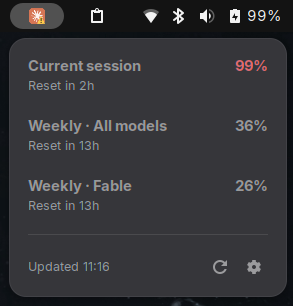

# Claude Quota — GNOME Shell extension

Track your Claude Pro usage from the GNOME top bar.

- A panel button shows the Claude icon plus your **current session** usage percentage.
- Clicking it opens a menu listing every active limit — session, weekly (all models), and per-model (e.g. Fable) — each with its percentage and reset time.
- Footer buttons: **Refresh** and **Settings**.



It reads the OAuth token that Claude Code already stores in
`~/.claude/.credentials.json` and calls the same `GET /api/oauth/usage`
endpoint that Claude Code's `/usage` command uses. Nothing is sent anywhere
except Anthropic's API.

> The token is only refreshed by Claude Code itself. If it expires, the panel
> shows a "Token expired" hint until you next use Claude Code.

## Requirements

- GNOME Shell 45–50
- libsoup 3 (ships with modern GNOME)
- An active Claude Pro/Max login in Claude Code

## Install (from a release zip)

Grab `claude-quota@andrearicchi.com.shell-extension.zip` from the
[Releases page](https://github.com/andrearicchi/gnome-shell-extension-claude-quota/releases),
then:

```sh
UUID=claude-quota@andrearicchi.com
gnome-extensions install --force claude-quota@andrearicchi.com.shell-extension.zip
gnome-extensions enable "$UUID"
```

Then reload GNOME Shell (**X11:** <kbd>Alt</kbd>+<kbd>F2</kbd>, `r`, <kbd>Enter</kbd>;
**Wayland:** log out and back in). `gnome-extensions install` compiles the
GSettings schema for you.

<details>
<summary>Manual fallback (no <code>gnome-extensions install</code>)</summary>

```sh
UUID=claude-quota@andrearicchi.com
DEST="$HOME/.local/share/gnome-shell/extensions/$UUID"
mkdir -p "$DEST"
unzip -o claude-quota@andrearicchi.com.shell-extension.zip -d "$DEST"
glib-compile-schemas "$DEST/schemas/"      # zip ships the .xml, not the compiled schema
gnome-extensions enable "$UUID"
```

</details>

Once it's live, the easiest route is the
[GNOME Extensions marketplace](https://extensions.gnome.org/) — one-click install
in the browser.

## Install (development)

```sh
UUID=claude-quota@andrearicchi.com
DEST="$HOME/.local/share/gnome-shell/extensions/$UUID"
ln -s "$PWD" "$DEST"                 # or copy the folder
glib-compile-schemas "$DEST/schemas/"
gnome-extensions enable "$UUID"
```

Then reload GNOME Shell:

- **X11:** <kbd>Alt</kbd>+<kbd>F2</kbd>, type `r`, <kbd>Enter</kbd>
- **Wayland:** log out and back in, or test in a nested session (below)

## Test in a throwaway session (no logout, safe)

`--nested` was removed in GNOME 50; use `--devkit` instead:

```sh
dbus-run-session -- bash -c '
  gnome-shell --devkit >/tmp/shell.log 2>&1 &
  sleep 8
  gnome-extensions enable claude-quota@andrearicchi.com
  sleep 5
  gnome-extensions info claude-quota@andrearicchi.com   # look for State: ACTIVE
'
grep -i "JS ERROR\|claude" /tmp/shell.log               # async errors surface here
```

## Run the tests

```sh
gjs -m test/usageModel-test.js   # pure logic (offline, uses captured fixture)
gjs -m test/live-fetch.js        # live end-to-end against your account
```

## Releasing

### Build a release zip

```sh
mkdir -p dist       # pack SEGFAULTS if --out-dir is missing
gnome-extensions pack --force \
  --extra-source=usageModel.js \
  --extra-source=usageClient.js \
  --extra-source=icons \
  --out-dir=dist \
  .
```

This produces `dist/claude-quota@andrearicchi.com.shell-extension.zip`. `pack`
only bundles `extension.js`, `prefs.js`, `stylesheet.css`, `metadata.json`, and
`schemas/` on its own — the `--extra-source` flags are what pull in the two extra
JS modules and the icons, without which the packaged extension breaks at runtime.

Verify the bundle is complete:

```sh
unzip -l dist/*.shell-extension.zip
# expect: extension.js, prefs.js, usageModel.js, usageClient.js, stylesheet.css,
#         metadata.json, icons/*.svg, schemas/*.gschema.xml
```

(The zip ships the schema `.xml`; `gnome-extensions install` and the marketplace
compile it on their side.)

### Cut a GitHub release

Pushing a `v*` tag builds the zip in CI and attaches it to a GitHub Release
(see `.github/workflows/release.yml`):

```sh
git tag v0.1.0        # match version-name in metadata.json
git push origin v0.1.0
```

The zip then appears on the repo's **Releases** page.

### Publish to the GNOME Extensions marketplace

Build the zip as above, then upload it at
<https://extensions.gnome.org/upload/> (login required; every version goes
through manual review). The marketplace assigns the integer `version`;
`metadata.json`'s `version-name` stays the human-facing string.

## Settings

- **Refresh interval** — seconds between polls (default 300; also refreshes on menu open and manual refresh). On an HTTP 429 the interval backs off exponentially and resets on the next successful poll.
- **Credentials path** — override the default `~/.claude/.credentials.json`.
